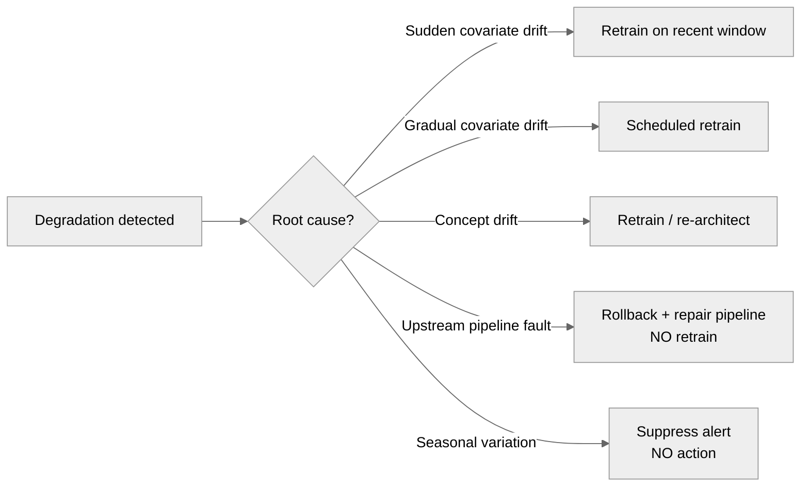
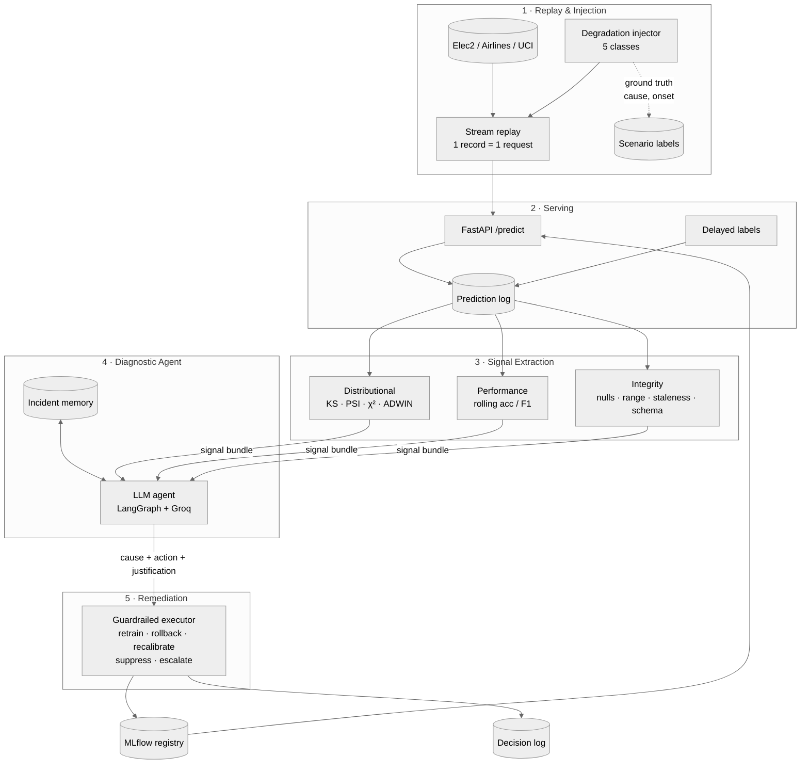
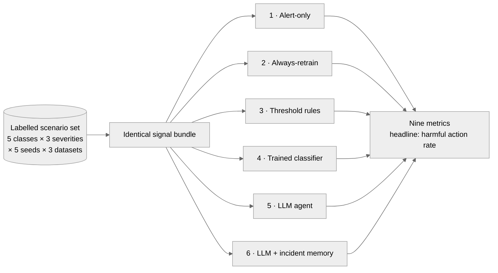

# AUTONOMA — Self-Healing MLOps

**Automated Root-Cause Diagnosis of Model Degradation for Self-Healing MLOps — Does LLM Reasoning Outperform Rule-Based Remediation?**

[](https://github.com/Tanny28/autonoma/actions)
[](LICENSE)
[](https://python.org)

Final year B.Tech Major Project — Computer Science and Engineering (Artificial Intelligence and Machine Learning), Pimpri Chinchwad University, Pune. Major Project I (UBTML408) and Major Project II (UBTML416), AY 2026–27.

---

## The problem

Machine learning models deployed in production degrade silently. Unlike conventional software, which fails visibly, a degraded model keeps executing and returns confident predictions that are increasingly wrong. The usual causes are data drift (the input distribution moves) and concept drift (the feature–target relationship changes).

Recent work has shown this degradation can be detected and remediated automatically by LLM-orchestrated agents. **Autonomous remediation is therefore not an open problem, and this project does not claim it as one.**

The gap is elsewhere. Existing systems act on the *fact* of degradation without establishing its *cause*, and so apply retraining uniformly. That is the wrong response in two situations:

- **Upstream pipeline fault** — nulls from a failed join, an inconsistent unit conversion, a feature frozen at a stale value. Retraining propagates the corrupted data into the model and compounds the fault.
- **Reversible seasonal fluctuation** — retraining discards a perfectly valid model in response to a change that would have resolved on its own.

In both cases the correct action is to withhold retraining, and no existing system can make that determination. Separately, no published evaluation compares an LLM remediation agent against deterministic rules on identical signals, so the reasoning layer's value is assumed rather than demonstrated.

## What AUTONOMA does

> Existing self-healing MLOps systems detect a problem and fix it one way, every time. We diagnose *why* it happened first, then pick the fix that actually matches — and we test whether the LLM is even necessary to do that, or whether simple rules would do just as well.

Three contributions, all currently absent from the literature:

1. **Root-cause diagnosis before remediation.** A diagnostic step classifies the cause into one of five classes, and only then selects the action. Two of the five must not trigger retraining.
2. **A rule-based and trained-classifier ablation that isolates LLM value.** Both baselines run on the identical signal bundle. If they match the agent, the honest conclusion is that LLM reasoning is unnecessary for this task — a valid, reportable negative result, not a failure of the project.
3. **Recurring-failure memory.** All prior work evaluates a single drift episode. We test whether access to past incident history improves diagnosis on a repeat occurrence of the same failure.

## The five degradation classes

The taxonomy is the heart of the project. Injection, signal extraction, agent classification and evaluation are all organised around it, and it lives in code as a single shared enum in [`core/taxonomy.py`](src/autonoma/core/taxonomy.py).

| Class | Injection mechanism | Correct remediation |
|---|---|---|
| Sudden covariate drift | Mean of selected numeric features displaced by k·σ instantaneously at index *t* | Retrain on recent window |
| Gradual covariate drift | Same displacement ramped linearly across *N* records | Scheduled retrain |
| Concept drift | Label rule inverted within a feature region, feature distributions held constant | Retrain, possibly re-architect |
| **Upstream pipeline fault** | Nulls injected; unit scaling applied; schema order swapped; feature frozen at a stale constant | **Do not retrain** — rollback and repair the pipeline |
| **Seasonal variation** | Sinusoidal displacement returning to baseline within a known period | **No action** — suppress the alert |

The two bold rows are where existing systems get it wrong. Each class is instantiated at 3 severities × 5 seeds × 3 datasets to give a reusable labelled scenario set.

### Diagnose first, then act

Where existing systems go straight from "degradation detected" to "retrain", AUTONOMA inserts a diagnostic step and picks the action that matches the cause:



## Architecture



Observability runs across every layer: Prometheus scrapes the serving API, Grafana visualises metrics and signals, and every autonomous decision is written to the PostgreSQL decision log with its justification.

The **integrity signal family** is the enabling piece: it is what makes a pipeline fault separable from genuine drift. Without it, the project's central distinction cannot be measured.

### Guardrails

Non-negotiable, and implemented before the agent that depends on them:

- The action space is fixed and enumerated — the agent cannot invent new actions.
- A retrained candidate must beat the incumbent on held-out data before it replaces it.
- Every action is reversible and logged together with the agent's stated reasoning.
- Rate limiting prevents oscillation between model versions.
- Human approval is configurable for high-impact actions.

## Evaluation

Two falsifiable hypotheses:

- **H1** — The LLM agent classifies cause more accurately than a deterministic rule policy on identical signals, with the improvement concentrated in the pipeline-fault and seasonal classes.
- **H2** — Prior incident context improves diagnostic accuracy and lowers MTTR on recurrence of a previously seen failure mode.

Six arms, all scored on the identical scenario set:




| Arm | Description | Purpose |
|---|---|---|
| 1 | Alert-only — detect, take no action | Represents current practice (Evidently, Arize) |
| 2 | Always-retrain on any drift signal | Represents published auto-retrain pipelines |
| 3 | Threshold rules on the same signals | Critical ablation — isolates LLM value |
| 4 | Trained classifier on the same signals | Critical ablation — conventional ML baseline |
| 5 | LLM diagnostic agent | Tests H1 |
| 6 | LLM agent + incident memory | Tests H2 |

Nine metrics: diagnostic accuracy, **harmful action rate**, cost-weighted diagnostic error, confidence calibration (Brier score and reliability diagram), detection latency, MTTR, performance retention, recurrence improvement, and inference cost and latency.

**Harmful action rate — retrains fired when the true cause was a pipeline fault or seasonal variation — is the headline metric.** No existing system reports it, and every existing system scores badly on it by construction.

### Data

No live production traffic is available, which is equally true of all comparable published work. We use stream replay: the first 30% of each dataset in temporal order trains the baseline and fixes the reference distribution; the remainder is replayed sequentially through the serving endpoint one record at a time; true labels are released after a configurable delay; degradation is injected at experimenter-chosen indices so ground truth is known.

- **Elec2** (OpenML, ~45k records, 8 features) — primary; standard concept-drift benchmark with documented genuine temporal drift
- **Airlines delay** (OpenML, ~539k records) — scale testing
- **UCI Credit Card Default** (30k records, 23 features) — cross-domain generalisation

## Repository layout

```
src/autonoma/
├── injection/       O1 — replay harness + 5-class injector
├── serving/         FastAPI model serving, request logging, delayed labels
├── signals/         O1 — distributional / performance / integrity extraction
├── agent/           O2 — LangGraph diagnostic agent + rule & classifier arms
├── remediation/     O3 — guardrailed executor
├── observability/   decision log, metrics, dashboards
└── core/            shared taxonomy, config, logging
infra/               Prometheus, Grafana, Postgres provisioning
docs/                architecture notes and figures
tests/
```

## Getting started

```bash
cp .env.example .env
make install
make test
```

Bring up the full stack (Postgres, Redis, MLflow, Prometheus, Grafana, serving API):

```bash
make up
```

| Service | URL |
|---|---|
| Serving API (docs) | http://localhost:8000/docs |
| MLflow | http://localhost:5000 |
| Prometheus | http://localhost:9090 |
| Grafana | http://localhost:3000 |

`make down` stops the stack; `make clean` also removes volumes.

## Status

Semester VII is in progress. O1 gates everything else — the agent cannot be evaluated until labelled degradation episodes exist.

| Component | Objective | Status |
|---|---|---|
| Serving layer, Docker stack, CI | — | Shipped |
| Shared five-class taxonomy | — | Shipped |
| Baseline model on Elec2 + MLflow registry | O1 | In progress |
| Replay harness + five-class injector | O1 | In progress |
| Three-family signal extraction | O1 | In progress |
| Alert-only and always-retrain arms | O4 | Planned, Sem VII |
| LLM diagnostic agent | O2 | Planned, Sem VIII |
| Rule and classifier ablation arms | O4 | Planned, Sem VIII |
| Guardrailed executor | O3 | Planned, Sem VIII |
| Incident memory and recurrence experiment | O2 | Planned, Sem VIII |
| Full six-arm evaluation | O4 | Planned, Sem VIII |

## Scope and limitations

Disclosed up front and kept consistent with the synopsis:

| Limitation | Mitigation |
|---|---|
| No live production data | Public datasets, sequential replay, controlled injection |
| Degradation is injected, not naturally occurring | Real benchmark datasets; all injection parameters documented; multiple severities and seeds |
| Lightweight benchmark models only | Conclusions explicitly restricted to the evaluated setting |
| LLM non-determinism | Fixed prompts, closed action space, repeated trials, calibration analysis |
| External LLM API dependency | Experiment outputs cached; inference cost and latency reported |
| Fixed five-class taxonomy | Documented explicitly; additional causes are future work |
| Limited compute | Lightweight models, containerised, runs on a standard laptop |

## Team

| Member | Layer |
|---|---|
| Tanmay Shinde | Diagnostic agent, remediation (O2, O3) |
| Dushyant Dhote | Model training and serving |
| Pranav Shimpi | Drift detection and signal extraction |
| Namrata Shinde | Observability and infrastructure |

**Guide:** Dr. Jaydeep Patil, Head of Department, CSE-AIML
**Project Coordinator:** Dr. Jayesh M. Sarwade

## References

Positioned against **Aueawatthanaphisut, A. and Lamichhane, B. R. (2026)**, *Trustworthy self-composable Big-Data-as-a-Service*, arXiv:2606.17915 — the closest prior work, which performs LLM-orchestrated drift remediation but without root-cause diagnosis, without a rule-based baseline, and on synthetic data only.

Also drawn on: Yang et al. (2025), arXiv:2506.07411 (LLM and RL self-healing for cloud infrastructure); Sculley et al. (2015) on hidden technical debt in ML systems; Gama et al. (2014) on concept drift adaptation; Bifet and Gavaldà (2007) for ADWIN; Yao et al. (2023) for ReAct; and Vela et al. (2022), *Scientific Reports*, which found temporal degradation in 91% of 128 model/dataset pairs.

> **Note on naming.** This project is unrelated to Reda et al. (2026), *Autonoma: A Hierarchical Multi-Agent Framework for End-to-End Workflow Automation* (arXiv:2603.19270), a general-purpose task-automation assistant. The name overlap is coincidental.

## License

MIT — see [LICENSE](LICENSE).
