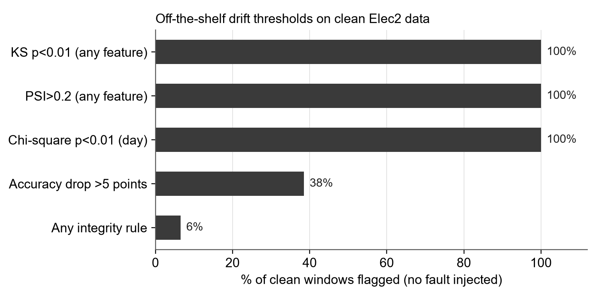
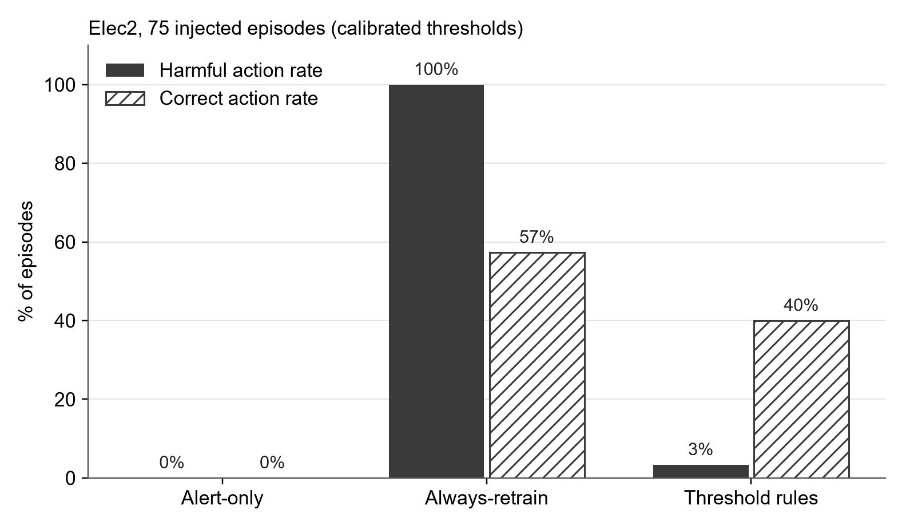

# Preliminary results (Review-II)

Reproduce: `PYTHONPATH=src python scripts/preliminary_experiment.py && python scripts/plot_preliminary.py`

## Dataset: Elec2 (OpenML 151)

| Item | Value |
|---|---|
| Records | 45,312 half-hourly records (48 per day, NSW and Victoria electricity market) |
| Features | 8: `date`, `day`, `period`, `nswprice`, `nswdemand`, `vicprice`, `vicdemand`, `transfer` |
| Target | price goes UP (42.5%) or DOWN (57.5%) relative to the last 24 h |
| Split | first 30% (13,593 records) trains the baseline; remaining 70% (31,719) is replayed as live traffic |
| Data quirk | `vicprice`, `vicdemand`, `transfer` are constant for the first 17,423 records (not recorded), so the training split never sees them vary |
| Data quirk | `day` is stored as text "1"–"7"; serving must treat it as categorical |

Baseline (gradient-boosted trees, `date` excluded): 71.7% accuracy on the replayed stream (majority class: 58.4%).
It degrades naturally where the Victoria features come alive: 75.5% before record 17,424, 67.4% for records 17,424–30,000, 74.2% after.

## Experiment

75 episodes: 5 degradation classes × 3 severities × 5 seeds, injected into real Elec2 segments.
Each episode is 3,500 records cut into 7 windows of 500; the fault starts at record 1,000.
Arms see only the signal bundle for each window, never the injected cause.

### Finding 1: off-the-shelf drift thresholds fire on every clean window

KS (p < 0.01), PSI (> 0.2) and chi-square tests flag 100% of windows with no injected fault, because
Elec2 drifts naturally week to week. A system that retrains on drift alarms would retrain constantly.

### Finding 2: with thresholds calibrated on clean history

Thresholds were set from clean windows in records 17,424–25,000; test episodes come only from records after 27,000.

| Arm | Harmful action rate | Correct action rate | Diagnostic accuracy |
|---|---|---|---|
| Alert-only | 0% | 0% | n/a |
| Always-retrain | 100% | 57% | n/a |
| Threshold rules | 3% | 40% | 29% |

- Always-retrain retrains every pipeline-fault and seasonal episode: the failure this project targets.
- Threshold rules almost never cause harm, and catch every pipeline fault (15/15), but they are crude:
  they often mistake genuine drift for a pipeline fault, because large shifts trip the out-of-range rule.
  Avoiding harm by rolling back too often is not the same as diagnosing correctly.
- That gap between "safe" and "correct" is what the classifier and LLM arms (Semester VIII) are meant to close.

### Rule arm: true cause (rows) vs diagnosis (columns), calibrated

| | concept | no action | seasonal | sudden | pipeline fault |
|---|---|---|---|---|---|
| concept drift | 1 | 4 | 0 | 6 | 4 |
| gradual drift | 0 | 3 | 1 | 2 | 9 |
| seasonal | 0 | 4 | 3 | 1 | 7 |
| sudden drift | 0 | 2 | 2 | 3 | 8 |
| pipeline fault | 0 | 0 | 0 | 0 | 15 |

## Limits of this run

Preliminary only: one dataset, one injected feature (`nswdemand`), 75 episodes, rule thresholds not yet tuned,
no delayed labels (labels assumed available per window). Not yet comparable to the planned full evaluation.
